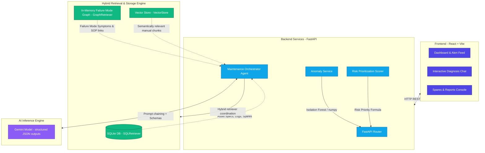
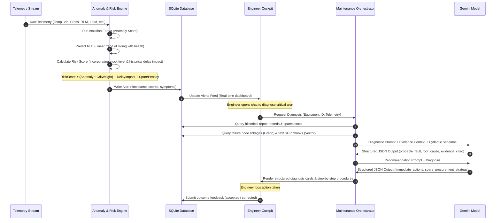

# Steel Plant Maintenance Cockpit

An intelligent, AI-powered decision-support and predictive maintenance platform designed for high-value manufacturing assets in steel plants (e.g., Blast Furnaces, Hot Rolling Mills, Hydraulic Systems, and Oxygen Furnaces).

The system continuously monitors multidimensional sensor telemetry, calculates operational risk based on historical delays and spare parts availability, detects anomalies using an Isolation Forest, and deploys a Retrieval-Augmented Generation (RAG) agentic pipeline using Gemini to perform Root Cause Analysis (RCA) and generate action plans.

---

## Architecture Diagram

The platform uses a decoupled frontend-backend architecture integrated with a multi-layered data retriever and a structured AI reasoning model.



---

## Data & System Flow Diagram

The process flow outlines how raw telemetry is converted into prioritized alerts and then investigated by a technician:



---

## Model Design & Reasoning Pipeline

The platform splits tasks between traditional machine learning models (optimized for speed/consistency) and Large Language Models (optimized for complex reasoning and unstructured data retrieval).

### 1. Predictive Anomaly & RUL Estimation
*   **Isolation Forest (Unsupervised)**: Trained using normal operating datasets (`anomaly_label == 0`). Features evaluated include:
    *   Temperature (°C)
    *   Vibration (mm/s)
    *   Pressure (bar)
    *   Rotational Speed (RPM)
    *   Motor Current (Amps)
    *   Coolant Flow Rate (LPM)
    *   Operating Load (%)
*   **Health Index Calibration**: Calibrates the raw anomaly model decision output to map values dynamically:
    *   Decision score \(\ge 0.05 \implies \text{Anomaly} = 0.0\) (Healthy)
    *   Decision score \(\le -0.15 \implies \text{Anomaly} = 1.0\) (Anomalous)
    *   Interpolated values in between.
*   **Remaining Useful Life (RUL)**: Runs a linear regression (`numpy.polyfit`) over the rolling 24 hours of health history (96 telemetry readings, sampled every 15 minutes). If the slope is negative, it projects when the health index will cross the critical degradation threshold (0.20):
    \[
    \text{Readings Remaining} = \frac{0.20 - \text{Current Health}}{\text{Slope}}
    \]

### 2. Retrieval-Augmented Generation (RAG) Reasoning Pipeline
The agent chains three sequential LLM reasoning tasks utilizing Gemini structured JSON generation via Pydantic schemas:

1.  **Diagnosis Engine**: Fuses current anomalous readings, SQL history, graph node details, and unstructured vector search chunks from equipment manuals. It outputs a structured diagnosis ([DiagnosisSchema](file:///backend/llm/response_schemas.py#L4-L9)) containing the probable fault, confidence score, root cause analysis, and cited evidence.
2.  **Recommendation Engine**: Consumes the diagnosis and spares status. It outputs a structured action plan ([RecommendationSchema](file:///backend/llm/response_schemas.py#L12-L16)) outlining immediate repair steps, long-term preventive actions, and a spare parts procurement strategy.
3.  **Logbook Report Generator**: Automatically translates the diagnostic outcome and action summary into a formal shift log draft ([ReportDraftSchema](file:///backend/llm/response_schemas.py#L18-L27)).

---

## Alerting & Prediction Logic

To prevent alarm fatigue, alerts are dynamically prioritized according to asset importance, historical delay severity, and maintenance readiness:

$$\text{Risk Score} = (\text{Anomaly Score} \times \text{Criticality Weight}) + \text{Delay Impact Score} + \text{Spare Shortage Penalty}$$

*   **Anomaly Score**: Model output scaled between `0.0` (normal) and `1.0` (anomalous).
*   **Criticality Weight**: Asset priority scale:
    *   *Critical*: `1.0`
    *   *High*: `0.8`
    *   *Medium*: `0.5`
    *   *Low*: `0.2`
*   **Delay Impact Score**: Average downtime delay caused by historical failures of this equipment, normalized to a 4-hour max ceiling:
    \[
    \text{Delay Impact Score} = \min\left(1.0, \frac{\text{Average Downtime Minutes}}{240}\right)
    \]
*   **Spare Shortage Penalty**: High-risk multiplier based on warehouse readiness:
    *   `1.0` penalty if *any* compatible spare part has `0` units in stock (Critical shortage).
    *   `0.5` penalty if stock level falls below the minimum required warehouse levels.
    *   `0.0` if stock levels are healthy.

### Risk Level Thresholds
The total score is capped at `3.0` and classified into actionable categories:
*   **Critical (\(\ge 2.0\))**: Red alert. Immediate shift lead notification and potential emergency shutdown sequence.
*   **High (\(\ge 1.2\))**: Orange alert. Maintenance crew dispatched for verification within the current shift.
*   **Medium (\(\ge 0.5\))**: Yellow alert. Flagged for inspection during the daily maintenance cycle.
*   **Low (\(< 0.5\))**: Normal. Standard continuous telemetry monitoring.

---

## Assumptions & Limitations

> [!WARNING]
> Review these system constraints before staging for production environments:

*   **Telemetry Sampling Interval**: The RUL and trend forecasting module assumes a consistent sampling rate of 15 minutes. High fluctuations or irregular intervals will distort the linear regression.
*   **Degradation Linearity**: RUL calculations use linear regression trends. True mechanical component wear is often exponential, manifesting as sudden failure cascades.
*   **Failure Modes Coverage**: The relational knowledge graph supports six static failure mode categories (`FM-001` through `FM-006`). Out-of-graph faults will rely purely on unstructured vector retrieval and general LLM reasoning.
*   **Vector Search Fallback**: In offline modes (without a Gemini API Key), the vector store falls back to a TF-IDF text bag similarity vectorizer, which is lexical and lacks semantic understanding of jargon.
*   **Database Concurrency**: The SQLite engine is selected for rapid development and testing. Production deployments with hundreds of high-frequency sensor readings require migrating to PostgreSQL or TimescaleDB.

---

## Installation, Configuration, & Execution

### 1. Prerequisites
Ensure you have the following installed:
*   Python 3.10 or higher
*   Node.js v18 or higher (with npm)
*   Git

### 2. Environment Configuration
Copy the environment template file and add your Google AI Studio Gemini API Key:

```bash
# Copy template env
cp .env.template .env
```

Open `.env` in a text editor and fill in your details:
```env
GEMINI_API_KEY=your_actual_gemini_api_key_here
HOST=127.0.0.1
PORT=8000
DEBUG=True
```

---

### 3. Backend Setup
Create a Python virtual environment and install the required backend dependencies:

```bash
# Create and activate virtual environment
python -m venv .venv

# On Windows (PowerShell):
.venv\Scripts\Activate.ps1
# On Linux/macOS:
source .venv/bin/activate

# Install requirements
pip install -r requirements.txt
```

---

### 4. Data & Model Preparation Pipeline
Run the lifecycle scripts in the following order to generate mock data, seed the database, train the machine learning model, and build the vector search index:

```bash
# 1. Generate synthetic sensor streams and telemetry datasets
python scripts/generate_synthetic_data.py

# 2. Seed SQLite database with asset lists, spares inventory, and logs
python scripts/seed_database.py

# 3. Train the Isolation Forest anomaly detector
python scripts/train_anomaly_model.py

# 4. Ingest equipment manuals and SOP text files into the Vector Store
python scripts/ingest_documents.py
```

---

### 5. Running Tests
You can verify the backend systems using the configured unit and integration test suite:

```bash
# Run pytest tests
pytest
```

---

### 6. Starting Backend and Frontend Servers

#### Run Backend Server
Ensure your virtual environment is active and start the FastAPI service:

```bash
# Start backend (accessible at http://127.0.0.1:8000)
python backend/app/main.py
```
*Note: API documentation is dynamically generated at `http://127.0.0.1:8000/docs`.*

#### Run Frontend Server
In a new terminal window, navigate to the frontend directory, install dependencies, and start the Vite development server:

```bash
# Navigate to frontend folder
cd frontend

# Install Node modules
npm install

# Start Vite local development server
npm run dev
```
*The web dashboard is hosted at the URL printed in your console (usually `http://localhost:5173`).*

---

## Key Files Reference
*   **Backend Main Entry**: [main.py](file:///backend/app/main.py)
*   **Orchestration Agent**: [maintenance_orchestrator.py](file:///backend/agents/maintenance_orchestrator.py)
*   **Risk Scoring Model**: [risk_scoring.py](file:///backend/prediction/risk_scoring.py)
*   **Anomaly Classifier Service**: [anomaly_service.py](file:///backend/prediction/anomaly_service.py)
*   **Database Schema Definition**: [models.py](file:///backend/db/models.py)
*   **Hybrid RAG Retrieve Engine**: [hybrid_retriever.py](file:///backend/retrieval/hybrid_retriever.py)
